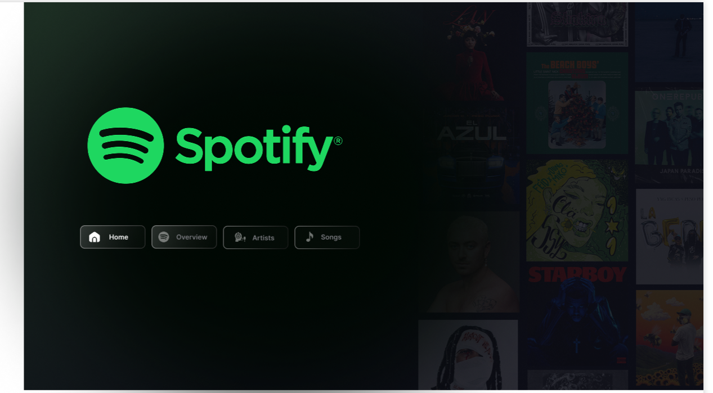
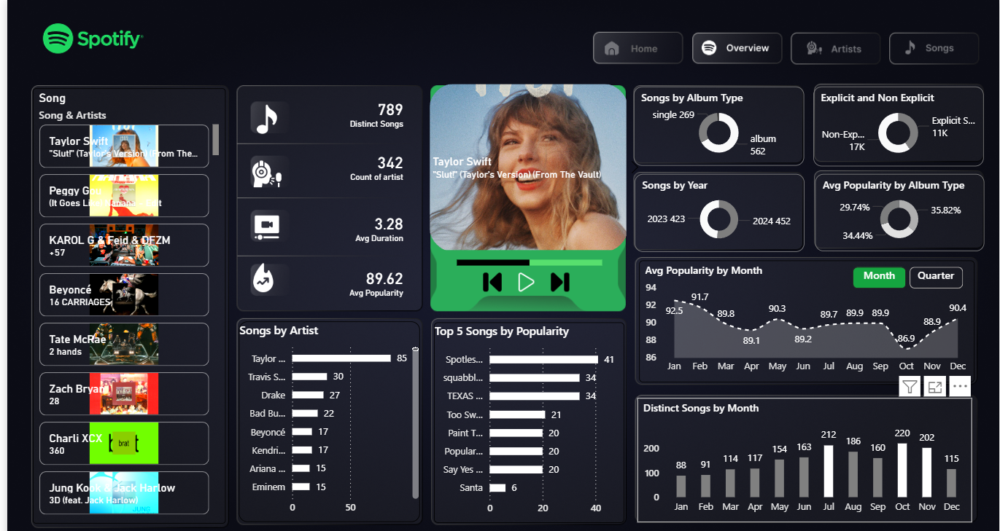
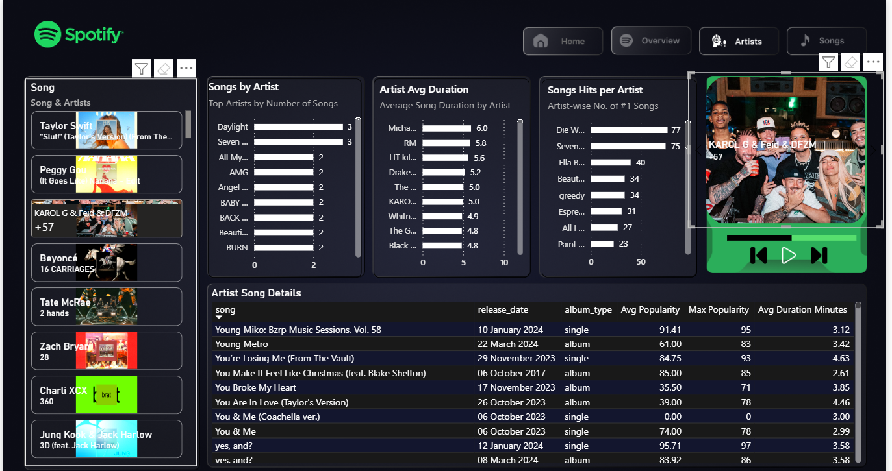
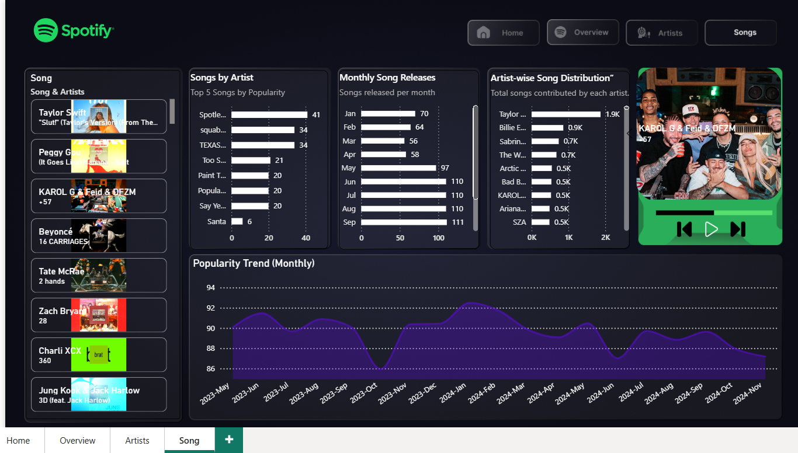

# Spotify-PowerBI-Dashboard
# 🎵 Spotify Top 50 Power BI Dashboard  
This project features an interactive Power BI dashboard analyzing the **Top 50 Global Spotify Songs**, providing insights on artists, song popularity, release trends, and listening patterns.

---

## 📌 Project Overview  
The goal of this dashboard is to visually explore Spotify's Top 50 songs dataset using Power BI.  
The dashboard includes:

- Artist performance metrics  
- Song popularity scores  
- Monthly release trends  
- Duration and trend analysis  
- A modern Spotify-inspired UI theme  

The report contains **4 pages: Home, Overview, Artists, and Songs**.

---

## 📊 Dashboard Pages & Insights  

### 🟢 1. **Home Page**
- Clean Spotify-themed UI  
- Quick navigation  
- Overview of all dashboard sections  

📸 *Screenshot:*  

---

### 📈 2. **Overview Page**
Includes:
- Total Songs  
- Total Artists  
- Average Popularity  
- Popularity Trend (Monthly)  
- Song Release Distribution  

📸 *Screenshot:*  

---

### 👨‍🎤 3. **Artists Page**
Displays:
- Top Artists by Popularity  
- Artist-wise Song Counts  
- Artist Distribution Donut Chart  
- Duration Analysis by Artist  

📸 *Screenshot:*  

---

### 🎶 4. **Songs Page**
Contains:
- Song list with cover art  
- Top 5 Songs by Popularity  
- Monthly Song Release Count  
- Popularity Trend Line Chart  

📸 *Screenshot:*  

---

## 🧠 Key Insights  
- Taylor Swift appears among the most popular artists.  
- Monthly popularity shows a slight declining trend.  
- Most tracks fall within a typical 3–4 minute duration.  
- Releases peak during certain months.  
- Some artists contribute significantly more songs than others.

---

## 🛠 Tech Stack  
- **Power BI Desktop**  
- **Power Query (ETL)**  
- **DAX (Data Modeling & Calculations)**  
- **Custom Theme (Spotify Dark UI)**  

---

## 📁 Project Structure  

Spotify-PowerBI-Dashboard/
│── spotify_dashboard.pbix
│── dax_measures.txt
│── Home.png
│── Overview.png
│── Artists.png
│── Songs.png
└── README.md

## 📐 DAX Measures  
All measures used in the report are available inside:  
**dax_measures.txt**

Includes:
- Popularity metrics  
- Duration calculations  
- Ranking  
- Monthly aggregations  
- Artist-level insights  

---

## 🚀 How to Use  
1. Download and open the `spotify_dashboard.pbix` file in Power BI Desktop.  
2. Navigate through the pages using the top menu.  
3. Interact with charts, slicers, and visuals to explore the dataset.
